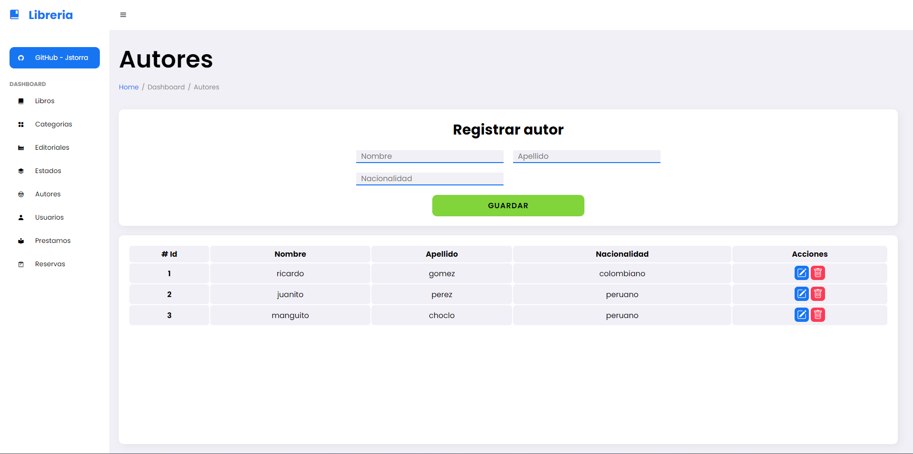

# Proyecto libreria

Proyecto sobre una libreria, este sistema permite registrar, actualizar y elimina registros de diferentes tipos, todo conectado a una base de datos tipo JSON y servidor creado con json-server.

## Secciones

-   [Requisitos](#requisitos)
-   [Caracteristicas](#caracteristicas)
-   [Tecnologias](#tecnologias-utilizadas)
-   [Como funciona](#como-funciona)
-   [Uso de App](#uso-de-app)
-   [Contribución](#contribución)
-   [Screenshots](#screenshots)

## Requisitos

Primero que todo debes tener instalado Node, en caso de no tenerlo instalado descarga la version **LTS** de la pagina oficial https://nodejs.org/es.

Una vez instalado asegurate de tener npm incorporado en tu sistema **(al instalar Node por defecto se instala)** para eso puedes abrir la terminal y ejecutar el comando `npm -v`.

## Caracteristicas

-   Registrar, actualizar y eliminar **libros**
-   Registrar, actualizar y eliminar **autores**
-   Registrar, actualizar y eliminar **categorias**
-   Registrar, actualizar y eliminar **editoriales**
-   Registrar, actualizar y eliminar **estados**
-   Registrar, actualizar y eliminar **prestamos**
-   Registrar, actualizar y eliminar **reservas**
-   Registrar, actualizar y eliminar **usuarios**

## Tecnologias utilizadas

-   HTML
-   CSS
-   JavaScript (ES6)
-   Node

## Como funciona

-   **Principal**

    -   `index.html`: Proporciona una estructura básica para una página web de un proyecto de librería con una barra lateral de navegación y una barra de navegación superior. Los archivos de estilo y JavaScript se utilizan para darle estilo y funcionalidad a la página.

    -   `app.js`: Código en JavaScript se utiliza para cambiar el contenido de una página web dinámicamente cuando se hace clic en enlaces específicos. Utiliza un módulo externo llamado "loadMains.js" para gestionar la carga de contenido en función de la página actual, y se dispara al cargar la página y al hacer clic en enlaces con identificadores específicos.

-   **Modules**

    -   `loadMains.js`: Cada función principal en el código se encarga de generar contenido HTML para diferentes secciones de la aplicación, como libros, categorías, editoriales, estados, autores, usuarios, préstamos y reservas. El código utiliza plantillas de cadena para crear formularios de registro y tablas de visualización de datos relacionados con estas entidades. Además, se importa un módulo llamado `cardsActions.js` para manejar las acciones asociadas con cada entidad, como guardar datos en el servidor.

    -   `cardsActions`: Este código es un conjunto de funciones que se utilizan para gestionar diferentes aspectos de la aplicación web, como la creación, actualización y eliminación de registros en una base de datos, la visualización de datos en tablas HTML y la interacción con formularios. Cada función se encarga de una entidad específica en la aplicación, como libros, categorías, editoriales, etc. Además, se incluyen eventos y funciones para mostrar y modificar datos relacionados con estas entidades.

    -   `btnsActions`: Este código exporta un conjunto de funciones que están diseñadas para manejar eventos de clic en botones HTML. Estas funciones se utilizan para interactuar con objetos de diferentes tipos, como libros, categorías, editoriales, estados, autores, usuarios, préstamos y reservas. El código se estructura de manera similar para cada tipo de objeto, por lo que se ha definido una serie de funciones genéricas para eliminar y modificar estos objetos.

-   **Functions**

    -   `crud.js`: Este codigo proporciona un crud y esta enlazado con el modulo `solicitudes.js` para las siguientes funciones:

        -   `getAll`: Recupera todos los registros de la tabla o endpoint especificado.
        -   `getOne`: Recupera un registro específico por su ID.
        -   `getRelationships`: Recupera relaciones entre registros en la tabla o endpoint.
        -   `getRelationshipsOne`: Recupera relaciones específicas para un registro por su ID.
        -   `post`: Crea un nuevo registro en la tabla o endpoint especificado.
        -   `putOne`: Actualiza un registro existente en la tabla o endpoint.
        -   `deleteOne`: Elimina un registro por su ID.

    -   `validaciones.js`: Este código en JavaScript contiene tres funciones que se utilizan para validar datos y objetos. La primera función valida un campo de datos específico, la segunda verifica si un objeto no está vacío y la tercera verifica si las identificaciones en un objeto existen a través de solicitudes a una URI.

## Uso de App

1. Clona este repositorio en tu máquina local:

    ```bash
    git clone https://github.com/jstorra/proyecto-libreria.git
    ```

2. Ejecuta el comando `npm i`para instalar las dependencias necesarias para el funcionamiento del proyecto.

3. Ejecuta el comando `npm run dev` para levantar el servidor y guardar los registros en el archivo `db.json`.

4. Abre el archivo `index.html` en tu navegador web para ver la libreria en acción.

## Contribución

Si deseas contribuir a este proyecto, ¡te animamos a hacerlo! Puedes enviar problemas (issues) y solicitudes de extracción (pull requests) para proponer mejoras o correcciones.

## Screenshots

<div align="center">
  <p style="font-size: 20px; color: #1775f1"><b>Libros</b></p>
  
  <p style="font-size: 20px; color: #1775f1"><b>Categorias</b></p>
  
  <p style="font-size: 20px; color: #1775f1"><b>Editoriales</b></p>
  
  <p style="font-size: 20px; color: #1775f1"><b>Estados</b></p>
  
  <p style="font-size: 20px; color: #1775f1"><b>Autores</b></p>
  
  <p style="font-size: 20px; color: #1775f1"><b>Usuarios</b></p>
  
  <p style="font-size: 20px; color: #1775f1"><b>Prestamos</b></p>
  
  <p style="font-size: 20px; color: #1775f1"><b>Reservas</b></p>
  
</div>

---

<p align="center">Developed by <a href="https://github.com/jstorra">@jstorra</a></p>
